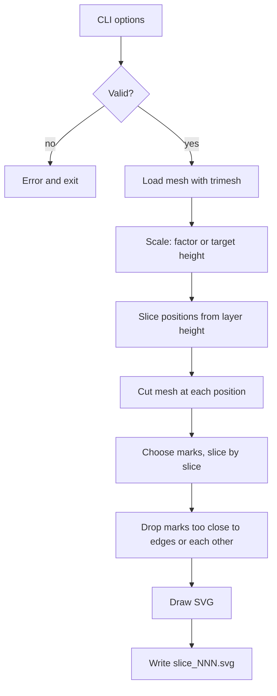
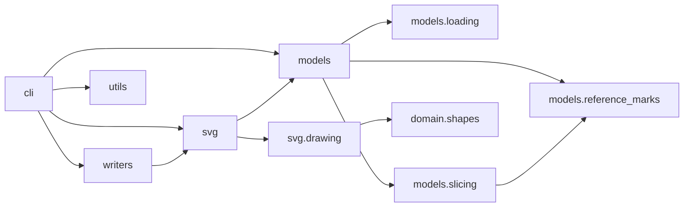
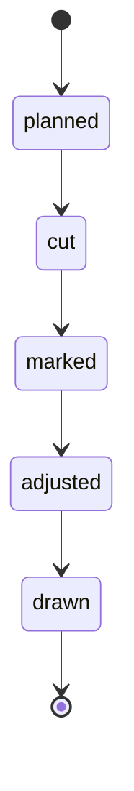

# Architecture

## Pipeline

One run of the `layerforge` command. The checks live in `cli.py::_read_settings_file` and `cli.py::resolve_settings`, and the pipeline in `cli.py::_run`. `process_model` calls all three. The command calls the two checks, asks for the STL path, then calls `_run`.

## Packages

Arrows point from a package to the packages it uses.

| Package | Role |
|---|---|
| `cli` | The `layerforge` command, `resolve_settings` (checks every option) and `_read_settings_file` (reads the config file) and `process_model`. Runs the pipeline. |
| `models.loading` | `LoaderFactory`, the `Mesh` interface, and the trimesh loader. |
| `models` | `ModelFactory` builds a `Model` (scaled mesh and layer height). |
| `models.slicing` | `SlicerService` computes positions and builds `Slice` objects. |
| `models.reference_marks` | Mark configuration, calculator, manager (shared registry), adjuster. |
| `svg` | `SVGGenerator` and `SliceSVGDrawer` draw one SVG per slice. |
| `svg.drawing` | One strategy per mark shape, looked up through `StrategyContext`. |
| `domain.shapes` | Shape data: circle, square, triangle, arrow. Each gives its closed outline as a polygon (TR-7). |
| `writers` | `SVGFileWriter` saves `slice_NNN.svg`. |
| `utils` | Shape registration, loader registration, file helpers, distance. |

## Slice states

The [formal specification](requirements.md) models each slice as moving through these states.

Slices are processed in order. A slice is marked only after the previous one is.
