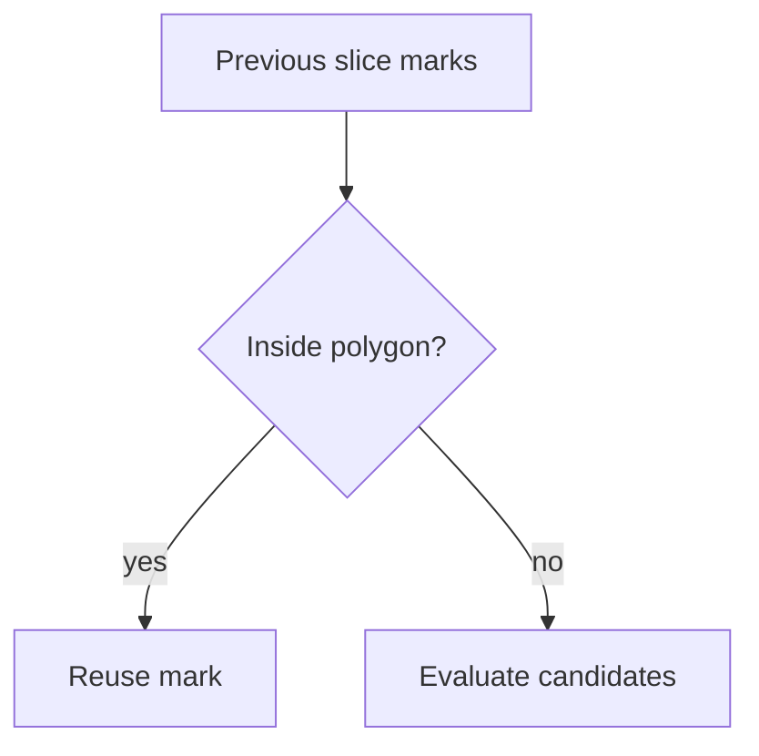

# Reference Mark Algorithm

This page details how LayerForge selects and refines alignment marks for each
slice. The algorithm is based on a geometric stability metric inspired by GDOP
(Geometric Dilution of Precision). It ensures marks remain consistent between
layers while avoiding overlaps.

## Candidate Scoring

For each contour a set of candidate points is sampled. The
`ReferenceMarkCalculator` computes a **stability score** equal to the total
pairwise distance between the points. Higher scores mean the marks are farther
apart and thus easier to align.

```python
class ReferenceMarkCalculator:
    @staticmethod
    def _stability_score(points: list[tuple[float, float]]) -> float:
        score = 0.0
        for i, p1 in enumerate(points):
            for p2 in points[i + 1:]:
                score += calculate_distance(p1[0], p1[1], p2[0], p2[1])
        return score
```

Marks are chosen iteratively. Existing marks from neighbouring layers are tried
first; otherwise the best scoring candidate is selected.

## Inheriting Marks

When processing a slice, the algorithm checks whether any stored mark lies inside
a contour at a safe distance from the edges. If so, that mark is reused and keeps
its original shape. This inheritance gives each layer a shared set of identifiers
for accurate reassembly.



## Adjusting Marks

After placement, marks may still be too close to a contour or to one another.
`ReferenceMarkAdjuster` filters marks that violate the configured minimum
separation:

```python
class ReferenceMarkAdjuster:
    @staticmethod
    def adjust_marks(marks, contours, config=None):
        adjusted = []
        for mark in marks:
            pt = Point(mark.x, mark.y)
            if any(poly.boundary.distance(pt) < config.min_distance for poly in contours):
                continue
            if any(pt.distance(Point(m.x, m.y)) < config.min_distance for m in adjusted):
                continue
            adjusted.append(mark)
        return adjusted
```

The final mark set thus respects minimum distances while preserving inherited
shapes whenever possible.

