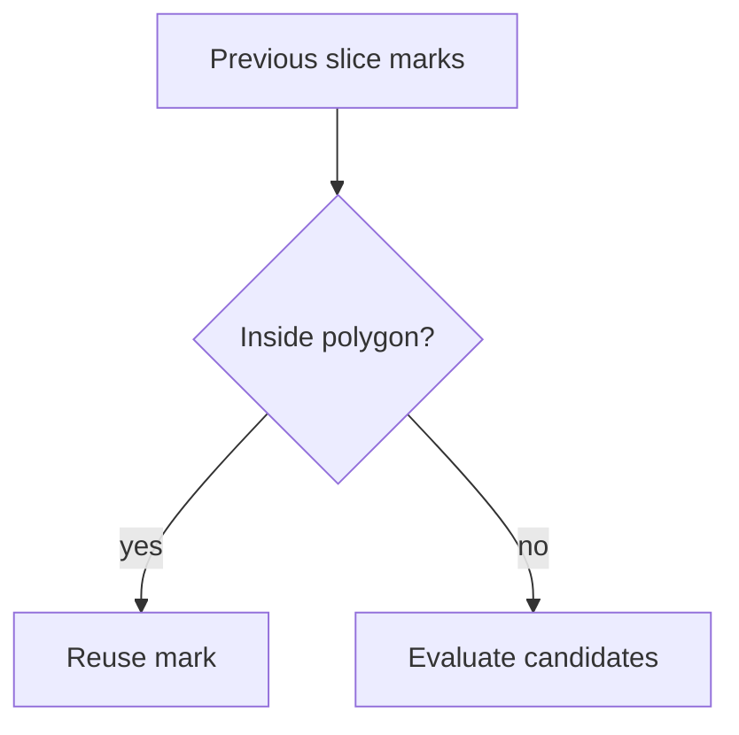
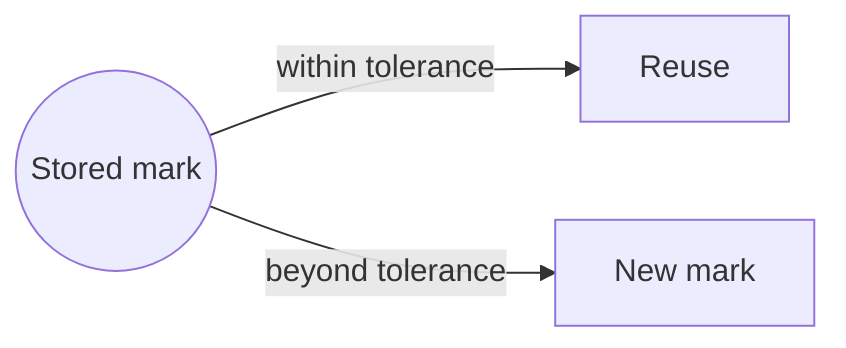
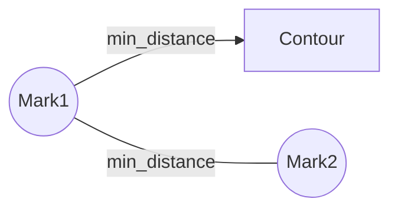
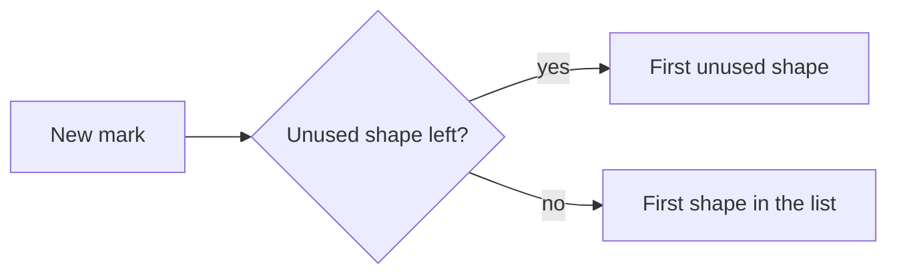
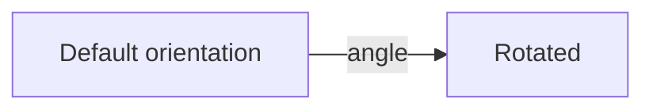

# Reference Mark Algorithm

This page details how LayerForge selects and refines alignment marks for each
slice. The algorithm is based on a geometric stability metric inspired by GDOP
(Geometric Dilution of Precision). It ensures marks remain consistent between
layers while avoiding overlaps.

## Candidate Scoring

For each contour a set of candidate points is sampled. The
`ReferenceMarkCalculator` computes a **stability score** equal to the total
pairwise distance between the points. Higher scores mean the marks are farther
apart and thus easier to align.

```python
class ReferenceMarkCalculator:
    @staticmethod
    def _stability_score(points: list[tuple[float, float]]) -> float:
        score = 0.0
        for i, p1 in enumerate(points):
            for p2 in points[i + 1 :]:
                score += calculate_distance(p1[0], p1[1], p2[0], p2[1])
        return score
```

Marks are chosen iteratively. Marks from earlier layers are tried
first; otherwise the best scoring candidate is selected.

## Inheriting Marks

When processing a slice, the algorithm checks whether any stored mark lies inside
a contour at a safe distance from the edges. If so, that mark is reused and keeps
its original shape **as well as its orientation angle and stroke color**. This
inheritance gives each layer a shared set of identifiers for accurate reassembly.


```mermaid
flowchart TD
    A[Previous slice marks] --> B{Inside polygon?}
    B -- yes --> C[Reuse mark]
    B -- no --> D[Evaluate candidates]
```

## Adjusting Marks

After placement, marks may still be too close to a contour or to one another, or
their hole may not fit the piece. `ReferenceMarkAdjuster` filters marks that violate
the configured minimum separation, and marks whose whole hole (the outline of the
shape, at its size and angle) does not lie inside a contour with the web to spare.
The web is `marks.min_web_ratio` times the layer height. The sketch below shows the
centre rules only:

```python
class ReferenceMarkAdjuster:
    @staticmethod
    def adjust_marks(marks, contours, config=None):
        adjusted = []
        for mark in marks:
            pt = Point(mark.x, mark.y)
            if any(poly.boundary.distance(pt) < config.min_distance for poly in contours):
                continue
            if any(pt.distance(Point(m.x, m.y)) < config.min_distance for m in adjusted):
                continue
            adjusted.append(mark)
        return adjusted
```

The final mark set thus respects minimum distances while preserving inherited
shapes whenever possible.

## Parameter Effects

The parameters controlling mark placement can be tuned to suit different model
sizes. The following diagrams illustrate how each option influences the final
reference marks.

### `tolerance`

A candidate position within the tolerance radius of a stored mark is that mark. It
takes the stored coordinates and look, and the nearest stored mark wins. Sampled
candidates in that range are skipped, so no two stored marks lie within the
tolerance of each other.


```mermaid
flowchart LR
    A((Stored mark)) -- within tolerance --> B[Reuse]
    A -- beyond tolerance --> C[New mark]
```

### `min_distance`

Marks must stay at least this far from contours **and** other marks. Holes
count as contour edges. If a contour is too small for any mark to keep this
distance, it gets no mark and a warning names the slice. Use a smaller
`min_distance` in that case.


```mermaid
flowchart LR
    C[Contour]
    M1((Mark1)) -- min_distance --> C
    M1 ---|min_distance| M2((Mark2))
```

### `available_shapes`

When a new mark is required it takes the first shape in the list that no mark
uses yet. Once all shapes are in use, new marks take the first shape again.


```mermaid
flowchart LR
    N[New mark] --> U{Unused shape left?}
    U -- yes --> F[First unused shape]
    U -- no --> S[First shape in the list]
```

### `angle`

Controls the orientation of newly generated marks. The command line option
`--mark-angle` takes degrees. Inside the package, angles are radians.


```mermaid
flowchart LR
    A[Default orientation] -- angle --> B[Rotated]
```

### `color`

Sets the stroke color used when drawing marks. It does not affect placement but
may improve visibility in the output SVGs.

#### Tips for Different Model Scales

The defaults follow the sheet, not the model. The mark size is the larger of the layer height and
1.5 times the kerf, the minimum distance is the mark size, and the tolerance is a tenth of it. With
a 3&nbsp;mm sheet and a 0.3&nbsp;mm kerf that is a size of 3, a distance of 3 and a tolerance of 0.3, whatever
the size of the model. So set `--layer-height` and `--kerf` for your material and machine, and leave
the rest.

- **Small pieces** – a mark needs room for its hole and for the web on each side. At the defaults a
  square piece must be a little over 6&nbsp;mm wide (6.003 gets no mark and 6.004 gets one; measured on a
  3&nbsp;mm sheet). A 10&nbsp;mm cube gets a mark in every layer. If a contour gets no mark, the warning names
  the slice: use a smaller `--mark-size`, or a thinner sheet.
- **Thick sheet** – the mark grows with the sheet (a 5&nbsp;mm sheet gives a size of 5, and its web is
  2.5), so a 10&nbsp;mm cube gets no marks at that sheet. Set a smaller `--mark-size`; a size below the
  least hole size for the sheet is a warning, not an error.
- **Large models** – the defaults need no change. Raise `--mark-tolerance` only if a mark drifts between
  layers.

## Planned changes

This page describes the algorithm as it is. The target adds a check that adjacent layers can be aligned in exactly one way, shapes chosen to fix rotation, marks chosen per pair of layers, and sizes that follow the sheet thickness. See [Alignment requirements](alignment_requirements.md).
