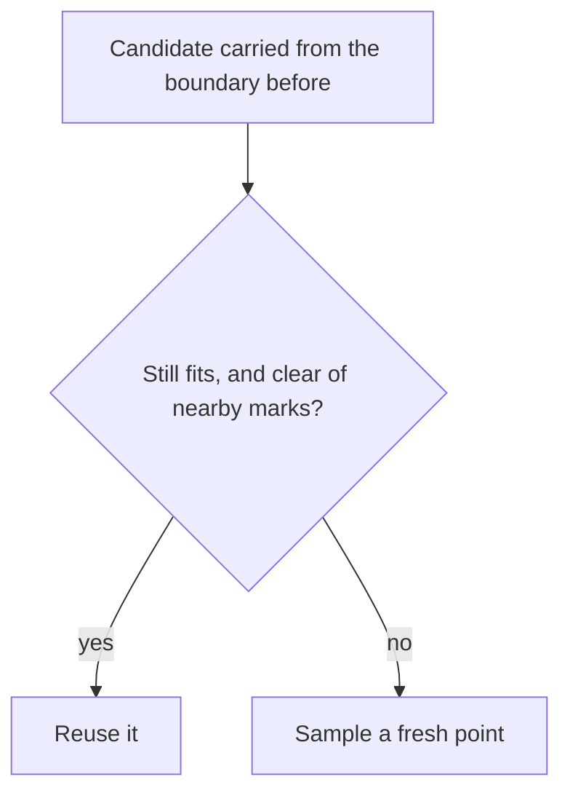
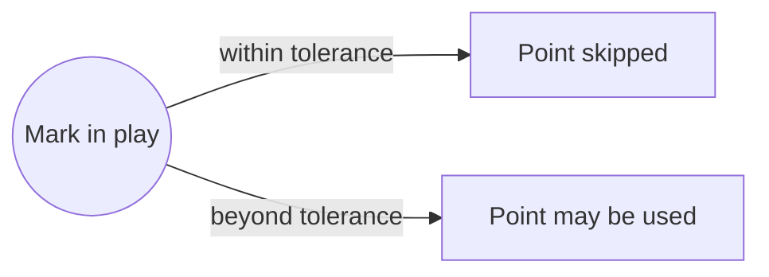
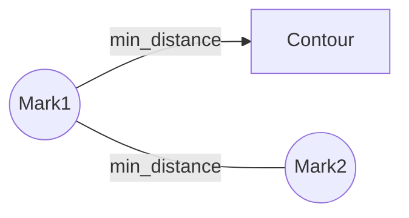
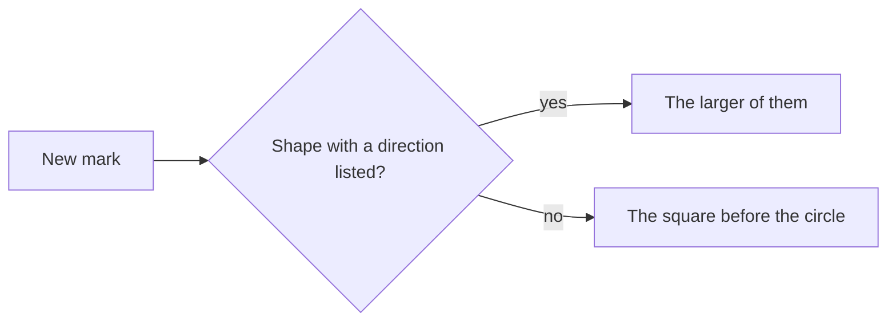
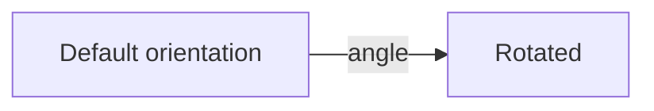

# Reference Mark Algorithm

This page details how LayerForge selects alignment marks for each pair of
adjacent layers, and carries them from one pair to the next (TR-9). A mark is
chosen inside two pieces' shared, shrunk overlap, reused across boundaries while
it still fits, and retired -- never revived -- the moment it does not.

A single-slice model has no adjacent layer to pair with at all, so it gets no
marks: there is nothing to align it to.

## Choosing a Mark for a Pair

For one pair of adjacent pieces, `ReferenceMarkCalculator.choose_mark_for_pair`
first tries every candidate carried from the boundary before it, in the order
given, and reuses the first one that still fits the new shrunk overlap and stays
clear of every mark already placed nearby. Only when none of them fit does it
choose a shape and sample fresh points inside the shared region -- the centroid
first, then a fixed-seed random sequence -- returning the first point that fits.
This is reuse-then-first-fit, not a maximised stability score, so a mark often
lands at or near the centroid, since that is usually the first point tried.

## Carrying Marks Between Pairs

`plan_marks` walks the boundaries between adjacent slices in order, one boundary
of lookback at a time: a mark carried from the pairing right before it, on the
same piece, is reused when it still fits; otherwise a fresh mark is chosen for
this pairing alone. A mark is retired -- simply not carried further -- the
instant it stops fitting; nothing revives one from farther back, and reuse never
survives past the one boundary where it stopped fitting.


```mermaid
flowchart TD
    A[Candidate carried from the boundary before] --> B{Still fits, and clear of nearby marks?}
    B -- yes --> C[Reuse it]
    B -- no --> D[Sample a fresh point]
```

A boundary that places no mark at all -- because its shrunk region is empty, or
nothing sampled clears tolerance -- still owes the next boundary its spacing: the
position(s) that were in play keep propagating, avoid-only, through consecutive
no-mark boundaries until a piece either gets a mark of its own (which then takes
over what the boundary after it must avoid) or the run ends. Within one such run
of consecutive no-mark boundaries, this keeps a fresh mark from landing within
tolerance of the position that would otherwise be forgotten (TR-10), without ever
making that missing mark itself reusable.

## Adjusting Marks

After placement, marks may still be too close to a contour or to one another, or
their hole may not fit the piece. `ReferenceMarkAdjuster` filters marks that violate
the configured minimum separation, and marks whose whole hole (the outline of the
shape, at its size and angle) does not lie inside a contour with the web to spare.
The web is `marks.min_web_ratio` times the layer height. The sketch below shows the
centre rules only:

```python
class ReferenceMarkAdjuster:
    @staticmethod
    def adjust_marks(marks, contours, config=None):
        adjusted = []
        for mark in marks:
            pt = Point(mark.x, mark.y)
            if any(poly.boundary.distance(pt) < config.min_distance for poly in contours):
                continue
            if any(pt.distance(Point(m.x, m.y)) < config.min_distance for m in adjusted):
                continue
            adjusted.append(mark)
        return adjusted
```

The final mark set thus respects minimum distances while keeping a reused
mark's shape and angle whenever possible.

## Parameter Effects

The parameters controlling mark placement can be tuned to suit different model
sizes. The following diagrams illustrate how each option influences the final
reference marks.

### `tolerance`

A fresh sampled point within the tolerance radius of a mark in play for its pairing
is skipped, so it cannot be taken for that mark (TR-10). The marks in play are the
candidates carried from the boundary before, the marks already placed on either
piece by a different pairing, and the positions kept through a boundary that places
no mark (above). A carried mark that still fits is reused with its
stored coordinates and look, before any fresh point is tried.


```mermaid
flowchart LR
    A((Mark in play)) -- within tolerance --> B[Point skipped]
    A -- beyond tolerance --> C[Point may be used]
```

### `min_distance`

Marks must stay at least this far from contours **and** other marks. Holes
count as contour edges. If a contour is too small for any mark to keep this
distance, it gets no mark, and the pair it belongs to fails the check before the files are
written (the command stops with exit code 1 and names the two slices; see
`--allow-unaligned`). Use a smaller `min_distance` in that case.


```mermaid
flowchart LR
    C[Contour]
    M1((Mark1)) -- min_distance --> C
    M1 ---|min_distance| M2((Mark2))
```

### `available_shapes`

A new mark takes the shape with the least symmetry that the list allows: a triangle
or an arrow (they have a direction), then a square, then a circle. Of two shapes with the
same symmetry the one with the larger outline wins, so the default list gives the triangle.
The order of the list does not matter. Every mark of a run has the same angle, so a mark
with a direction fixes the rotation of its piece and a circle or a square does not.


```mermaid
flowchart LR
    N[New mark] --> D{Shape with a direction listed?}
    D -- yes --> L[The larger of them]
    D -- no --> S[The square before the circle]
```

### `angle`

Controls the orientation of newly generated marks. The command line option
`--mark-angle` takes degrees. Inside the package, angles are radians.


```mermaid
flowchart LR
    A[Default orientation] -- angle --> B[Rotated]
```

#### Tips for Different Model Scales

The defaults follow the sheet, not the model. The mark size is the larger of the layer height and
1.5 times the kerf, the minimum distance is the mark size, and the tolerance is a tenth of it. With
a 3&nbsp;mm sheet and a 0.3&nbsp;mm kerf that is a size of 3, a distance of 3 and a tolerance of 0.3, whatever
the size of the model. So set `--layer-height` and `--kerf` for your material and machine, and leave
the rest.

- **Small pieces** – a mark needs room for its hole and for the web on each side. At the defaults
  (a 3&nbsp;mm sheet) a stack needs a little over 6&nbsp;mm width for a mark: measured on a
  6&nbsp;mm-square piece 9&nbsp;mm tall (three 3&nbsp;mm layers, so two boundaries), a 6.000&nbsp;mm
  width gets no mark on any of its three slices, while 6.003&nbsp;mm and 6.004&nbsp;mm each get one
  on every slice (`tests/test_disc_matches_chosen_shape.py`). A 10&nbsp;mm cube at the same defaults
  gets marks throughout. If a piece gets no mark, the check names the pair of slices and stops the
  run: use a smaller `--mark-size`, or a thinner sheet. A model of one layer has no neighbour to
  align to, so it passes without a message.
- **Thick sheet** – the mark grows with the sheet (a 5&nbsp;mm sheet gives a size of 5, and its web is
  2.5), so a 10&nbsp;mm cube gets no marks at that sheet. Set a smaller `--mark-size`; a size below the
  least hole size for the sheet is a warning, not an error.
- **Large models** – the defaults need no change. Raise `--mark-tolerance` only if a mark drifts between
  layers.

## Still open

This page describes the algorithm as it now runs: shapes chosen to fix rotation, marks chosen
per pair of adjacent layers, and sizes that follow the sheet thickness are all built. Still open:
a check that adjacent layers can be aligned in exactly one way (TR-2, #92). See
[Alignment requirements](alignment_requirements.md).
